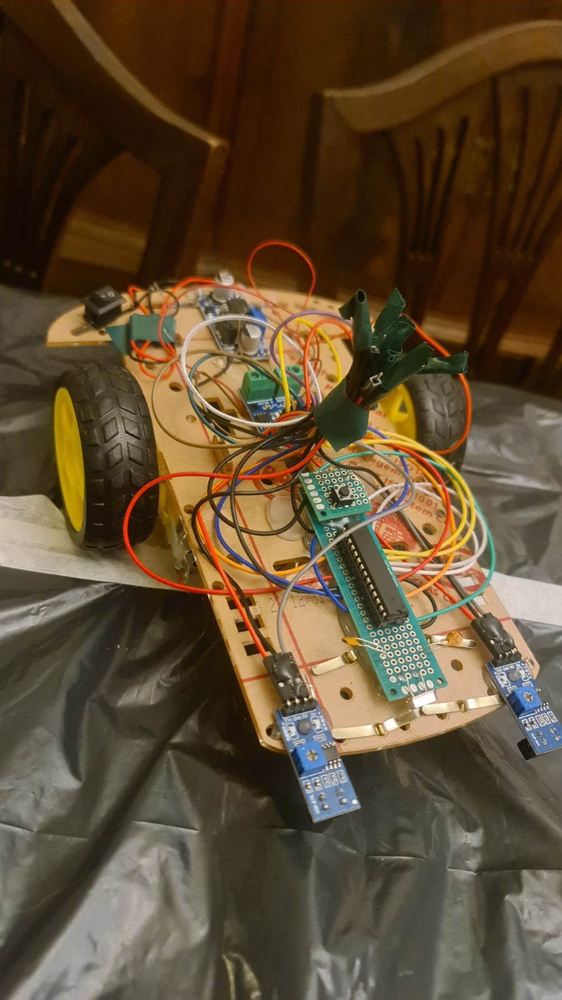
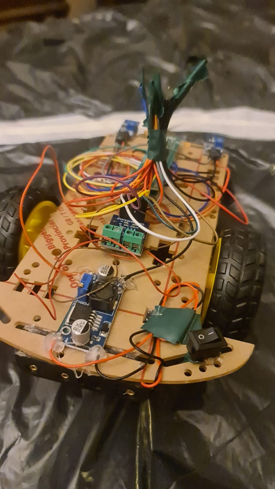

# Proyecto Seguidor de Línea

Seguidor de línea implementado mediante un microcontrolador atmega 328p

- Informe: [TP Integrador Informe ](./TP_Integrador_Informe_Agustin_Zuretti_95605.pdf)
- Código fuente: [LineFollower.asm](./TpIntegradorVFinal.asm)

## Imágenes del Proyecto

## Video de Demostración

Descargar video de demostración del proyecto [aquí](./video_demostracion.mp4).

<video width="600" controls>
  <source src="./video_demostracion.mp4" type="video/mp4">
  Tu navegador no soporta la reproducción de videos.
</video>

